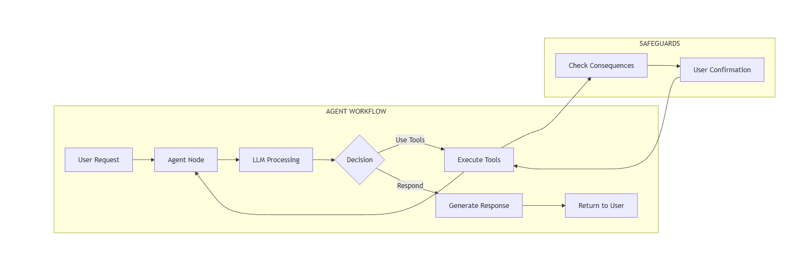

# Movi - Multimodal Transport Agent

## Overview

Movi is an AI-powered assistant for MoveInSync's transport management platform. It's a knowledge-aware agent that helps transport managers perform complex tasks using voice, text, images inputs. Built with LangGraph for robust stateful orchestration and React for the frontend interface.

## Architecture

### System Components



## Setup Instructions

### Prerequisites

- Node.js 16+ and npm
- Python 3.10+
- SQLite
- Gemini API key

### Backend Setup

1. **Clone the repository**
   ```bash
   git clone https://github.com/abhi-gowdaa/moveinsync.git
   cd backend
   ```

2. **Create virtual environment**
   ```bash
   cd backend
   python -m venv venv
   source venv/bin/activate  # On Windows: venv\Scripts\activate
   ```

3. **Install dependencies**
   ```bash
   pip install -r requirements.txt
   ```

4. **Rename .env.example to .env**
   ```bash
    .env.example to -> .env
   ```
 **important step 
   go to  google gemini website (https://aistudio.google.com/)/ and get your api key
   Edit `.env`:
   ```
   GOOGLE_API_KEY=your_gemini_api_key
   GEMINI_API_KEY=your_gemini_api_key
   # or for SQLite default:
   DATABASE_URL=sqlite:///./movi.db
   ```

5. **Initialize database**
   ```bash
   python scripts/init_db.py
   python scripts/seed_data.py
   ```

6. **Run backend server**
   ```bash
   uvicorn main:app --reload --port 8000
   ```

### Frontend Setup

1. **Navigate to frontend directory**
   ```bash
   cd frontend
   ```

2. **Install dependencies**
   ```bash
   npm install
   ```

4. **Rename .env.example to .env**
   ```bash
    .env.example to -> .env
   ```
   ```
   
**important step 
   go to  groq website https://groq.com/ and get your api key
   Edit `.env`:
   ```
   REACT_APP_API_URL=http://localhost:8000
    REACT_APP_GROQ_API_KEY=your_groq_api_key
   ```

4. **Start development server**
   ```bash
   npm start
   ```

5. **Access the application**
   - Open browser to `http://localhost:3000`

### Technology Stack

**Frontend:**
- React.js
- Axios for API communication
- Web Speech API (Speech-to-Text & Text-to-Speech)
- Material-UI or Tailwind CSS

**Backend:**
- Python 3.10+
- LangGraph for agent orchestration
- FastAPI for REST API
- LangChain for LLM integration
- Gemini API (or compatible LLM)

**Database:**
-  SQLite 
- SQLAlchemy ORM

## LangGraph Architecture

### Agent State (`state.py`)

```python
class AgentState(TypedDict):
    messages: List[BaseMessage]
    user_message: str
    response: str
    session_id: str
    current_page: str  # 'busDashboard' or 'manageRoute'
    awaiting_confirmation: bool
    pending_action: Optional[Dict]
    consequence_info: Optional[Dict]
    tool_calls: List[Dict]
```

### Graph Nodes

1. **Agent Node (`call_model`)**: 
   - Processes user input through the LLM
   - Determines intent and required actions
   - Generates tool calls or final responses

2. **Tool Node (`tool_node`)**:
   - Executes database operations
   - Handles multimodal inputs (vision processing)
   - Returns results to agent for processing

3. **Check Consequences Node (`check_consequences`)**:
   - Critical "Tribal Knowledge" implementation
   - Analyzes impact of proposed actions
   - Queries database for booking status, dependencies
   - Sets `awaiting_confirmation` flag if action has consequences

4. **Handle Confirmation Node (`handle_confirmation`)**:
   - Waits for user's yes/no response
   - Executes or cancels pending action
   - Returns appropriate feedback

### Conditional Edges

The graph uses sophisticated conditional routing:

```python
# From Agent Node
agent → should_continue() → {
    "tools": check_consequences,  # Tool execution needed
    "end": END                     # Direct response, no tools
}

# From Check Consequences
check_consequences → {
    "handle_confirmation": handle_confirmation,  # Action has consequences
    "tools": tools                                # Safe to execute
}

# From Handle Confirmation
handle_confirmation → {
    "agent": agent,      # Get confirmation response
    "complete": END      # Action completed
}

# From Tools
tools → agent  # Always return to agent for response generation
```

### Workflow Example: "Tribal Knowledge" Flow

**Scenario:** User asks to remove vehicle from a booked trip

```
1. User Input: "Remove vehicle from Bulk-0001"
   ↓
2. Agent Node: Identifies intent → generate tool_call
   ↓
3. Check Consequences Node: 
   - Queries DB: trip is 25% booked
   - Sets awaiting_confirmation = True
   - Stores consequence_info
   ↓
4. Handle Confirmation Node:
   - Returns: "This trip is 25% booked. Removing the vehicle will
             cancel bookings. Do you want to proceed?"
   - Graph waits in this state
   ↓
5. User responds: "Yes" or "No"
   ↓
6. Handle Confirmation Node:
   - If Yes: Executes removal, updates DB
   - If No: Cancels action
   ↓
7. Agent Node: Generates final response
   ↓
8. END
```

## Data Model

### Static Assets (Layer 1)

**Stops**
```sql
- stop_id (PK)
- name
- latitude
- longitude
```

**Paths**
```sql
- path_id (PK)
- path_name
- ordered_stop_ids (JSON/Array)
```

**Routes**
```sql
- route_id (PK)
- path_id (FK)
- route_display_name (e.g., "Path2-1945")
- shift_time
- direction
- start_point
- end_point
- status ('active', 'deactivated')
```

### Dynamic Assets (Layer 2)

**Vehicles**
```sql
- vehicle_id (PK)
- license_plate
- type ('Bus', 'Cab')
- capacity
```

**Drivers**
```sql
- driver_id (PK)
- name
- phone_number
```

**DailyTrips**
```sql
- trip_id (PK)
- route_id (FK)
- display_name
- booking_status_percentage
- live_status (e.g., '00:01 IN')
```

**Deployments**
```sql
- deployment_id (PK)
- trip_id (FK)
- vehicle_id (FK)
- driver_id (FK)
```

## Movi Capabilities

### 1. Multimodal Input/Output

- **Text Input**: Standard chat interface
- **Voice Input**: Speech-to-Text using Web Speech API
- **Image Input**: Vision processing for dashboard screenshots
- **Text-to-Speech**: Audio responses

### 2. Supported Actions (10+)

#### Read Operations (Dynamic)
1. "How many vehicles are not assigned?"
2. "What's the status of the 'Bulk-0001' trip?"
3. "Show me all active deployments"

#### Read Operations (Static)
4. "List all stops for 'Path2'"
5. "Show me all routes that use 'Path1'"
6. "What are all the available paths?"

#### Create Operations (Dynamic)
7. "Assign vehicle 'MH123456' and driver 'Amit' to the Geoone-0059 trip"
8 add kiran to MH123456 from NoShow-BTS-1300


#### Create Operations (Static)
8. "Create a new stop called 'Odeon Circle'"
9 8. "Create a new stop called 'High way'"
10. "Create a new path called 'Mac-Loop' using stops [Gavipuram, Temple, Peenya]"

#### Delete Operations (Dynamic)
11. "Remove the vehicle from Bulk-0001 '  triggers consequence checking)
12 remove MH123456 from NoShow-BTS-1300
12. "Unassign KA01AB1234 from 'Path Path-0002'"

### 3. Context Awareness

Movi understands which page the user is on:
- `busDashboard`: Focuses on deployment, trips, live status
- `manageRoute`: Focuses on stops, paths, routes creation


## Project Structure

```
movi-agent/
├── backend/
│   ├── agent/
│   │   ├── __init__.py
│   │   ├── graph.py           # LangGraph workflow
│   │   ├── nodes.py           # Graph node implementations
│   │   ├── state.py           # Agent state definition
│   │   └── tools.py           # Tool implementations
│   ├── api/
│   │   ├── __init__.py
│   │   └── routes.py          # FastAPI endpoints
│   ├── Models/
│   │   ├── __init__.py
│   │   ├── models.py          # SQLAlchemy models

│   ├── Service/
│   │   ├── init_db.py         # Database initialization
│   │   └── DBservice
            └──database.py
    └──seed_data.py       # Dummy data population
│   ├── main.py                # FastAPI application
│   └── requirements.txt
├── frontend/
│   ├── public/
│   ├── src/
        └──Components/
│   │   ├── Pages/
│   │   │   ├── BusDashboard/
│   │   │   ├── ManageRoute/
│   │   └── Hooks/
│   │   ├── services/
│   │   │   └── api.js
│   │   ├── App.js
│   │   └── index.js
│   └── package.json
└── README.md
```

## Key Features Demonstrated

**LangGraph Agent**: Stateful, multi-step orchestration  
**Tribal Knowledge**: Consequence checking with confirmation flow  
**Multimodal Input**: Text, voice, and image processing  
**Context Awareness**: Page-specific agent behavior  
**10+ Actions**: Comprehensive CRUD operations  
**Memory Management**: Conversation history via MemorySaver  
**Conditional Routing**: Complex decision logic in graph  

 

 
